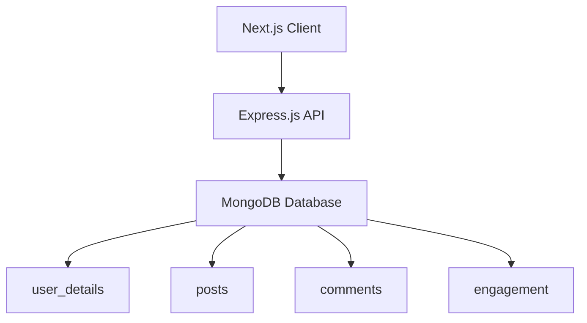

# Intrnr: Decentralized Community Forum

A full-stack blockchain-enabled community forum with mnemonic-based identity recovery.  
Built with Next.js (frontend), Node.js/Express (backend), MongoDB, and BIP39/SHA-256 cryptography.

---

## Table of Contents

1. [Project Overview](#project-overview)  
2. [Features](#features)  
3. [Tech Stack](#tech-stack)  
4. [Architecture](#architecture)  
5. [Installation & Setup](#installation--setup)  
6. [Usage](#usage)  
7. [API Reference](#api-reference)  
8. [Folder Structure](#folder-structure)  
9. [Development Notes](#development-notes)  
10. [Contributing](#contributing)  
11. [License](#license)  

---

## Project Overview

Intrnr is a decentralized forum that leverages mnemonic-based identity recovery on the blockchain.  
Users sign up by generating a 12-word recovery phrase, which derives their public/private keypair.  
Passwords and private keys are stored locally; only public keys and user metadata are stored on MongoDB.  
Login and authentication rely on users entering their recovery phrase to regenerate and verify their public key.

---

## Features

- **Mnemonic Identity**: 12-word BIP39 phrase generates deterministic keypair.  
- **Secure Signup/Login**: SHA-256 hashing, no server-side password storage.  
- **Persistent Data**: MongoDB stores public keys, posts, comments, engagement.  
- **RESTful API**: Express.js routes for auth, posts, comments, likes/dislikes.  
- **Interactive UI**: Next.js client components, modal dialogs for post views.  

---

## Tech Stack

- **Frontend**: Next.js 13 (App Router, React Hooks)  
- **Backend**: Node.js, Express.js  
- **Database**: MongoDB (local `intrnrDB`)  
- **Crypto**: `bip39` for mnemonic, Node.js `crypto` for SHA-256  
- **Other**: CORS, UUID, nodemon (dev)

---

## Architecture



Mnemonic Generation Keypair Derivation
(bip39) (SHA-256)

- Client calls `/auth/signup`, `/auth/login` for user flows.  
- Protected pages fetch `/post`, `/comment`, `/engagement` routes.  
- LocalStorage holds `intrnr_local_password`, SessionStorage holds email hint.  

---

## Installation & Setup

1. **Clone the Repo**  
   ```bash
   git clone https://github.com/yourusername/intrnr.git
   cd intrnr
   ```
   
2. Setup Backend
   ```bash
   cd backend
   npm install
   ```


3. Configure MongoDB

Ensure MongoDB is running locally at mongodb://localhost:27017.
Database: intrnrDB, Collections: user_details, posts, comments, engagement.

4. Run Backend Server
   ```bash
   npm run dev       # nodemon app.js
   # or
   node app.js
   ```

5. Setup Frontend

   ```bash
   cd ../frontend
   npm install
   ```
   
5. Run Frontend

   ```bash
   npm run dev
   # Visit http://localhost:3000
   ```
   
---

## Usage
1. Sign Up
  - Navigate to /signup.
  - Enter name, email, password.
  - Download mnemonic or verify phrase.

2. Log In
  - Enter email hint.
  - Input full 12-word mnemonic to regenerate public key.
  - Upon success, redirected to /feed.
   
3. Feed
 - Browse public posts.
 - Click View Post to open modal.
 - Like/Dislike or comment on posts.

---

API Reference
Auth Routes (/auth)

Method	Endpoint	Description
POST	/signup	Create user, return mnemonic + priv.
POST	/login	Verify mnemonic, return success.
GET	/userinfo	Fetch current user by session/email.
Posts Routes (/post)

Method	Endpoint	Description
GET	/post	Fetch all public posts.
POST	/post	Create a new post.
POST	/post/:id/like	Like a post.
POST	/post/:id/dislike	Dislike a post.
POST	/post/:id/comment	Add comment to a post.
Engagement (/engagement) & Comments (/comment)
GET /engagement?post_id=...

POST /engagement { post_id, action, public_key }

GET /comment?post_id=...

POST /comment { post_id, public_key, content }

Folder Structure
pgsql
Copy
Edit
intrnr/
├── backend/
│   ├── app.js
│   ├── package.json
│   ├── config/
│   │   └── db.js
│   ├── controllers/
│   │   ├── authController.js
│   │   ├── postController.js
│   │   ├── commentController.js
│   │   └── engagementController.js
│   ├── crypto/
│   │   └── keys.js
│   └── routes/
│       ├── auth.js
│       ├── post.js
│       ├── comment.js
│       └── engagement.js
└── frontend/
    ├── app/
    │   ├── page.js
    │   ├── signup/page.js
    │   ├── login/page.js
    │   └── feed/page.js
    ├── components/
    ├── package.json
    └── public/
Development Notes
Environment: Node.js v18+, Next.js 13+, MongoDB 5+.

Local Storage: stores device-specific password.

Session Storage: holds email hint for login flow.

Auto-Increment IDs: handled via countDocuments() + 1.

Contributing
Fork the repo

Create feature branch (git checkout -b feat/YourFeature)

Commit changes (git commit -m 'Add feature')

Push (git push origin feat/YourFeature)

Open a Pull Request
